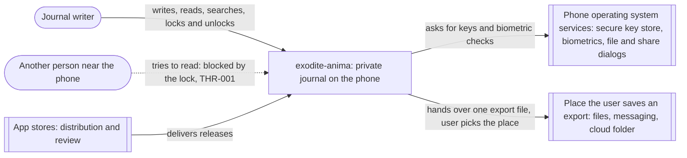
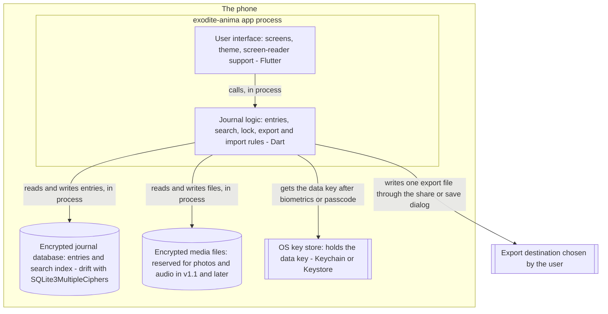
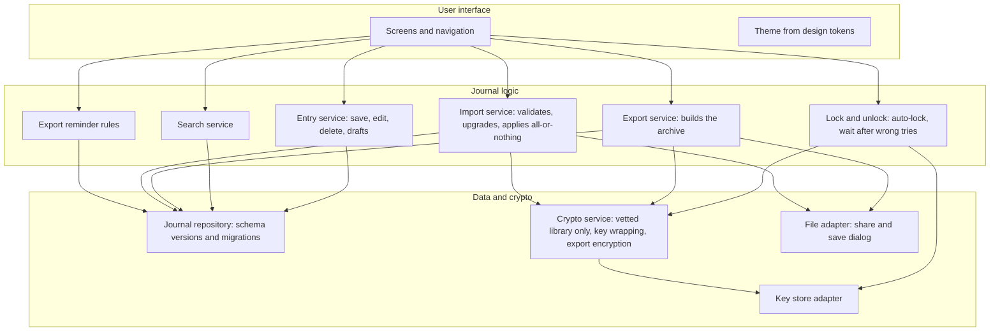
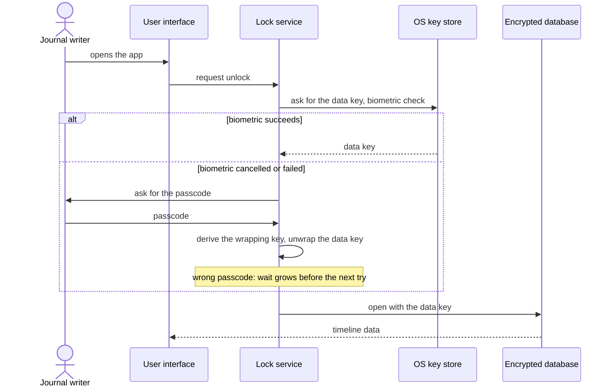
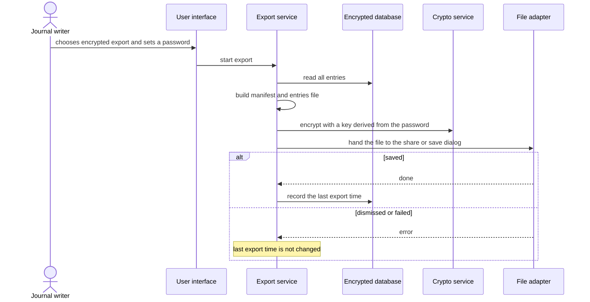

# C4 Diagrams

Method: skill `c4-diagramming`. Diagrams are Mermaid text, so they diff and live with the repo. Names follow `_shared/glossary.md`. Status: draft, version 1, 2026-09-20. Related: ADR-001 to ADR-005, THR-001 to THR-013.

Legend: dashed border = external to the app (owned by the OS or a store); solid = owned by the project. Trust boundaries are shown as subgraphs.

## Level 1: System context
Question: who and what does the app touch? Scope: production build. No technology is shown.

Notes: there is no server, account, or analytics endpoint. The app sends nothing anywhere by itself; the only outward path is the export file the user chooses to save (ADR-005).

## Level 2: Containers
Question: what runs on the phone, and where does data live? Trust boundary: everything inside "The phone" is on the user's device; the export destination is outside the app's control.

Every arrow within the phone is a direct in-process or local call. There are no network arrows, which ADR-005 turns into a build-checked property.

## Level 3: Components of the app process
Question: what are the main building blocks inside the app, and who may talk to whom? Shown because the app holds all the logic and the security-sensitive parts must stay small and separate.

Rules this view enforces: only the crypto service handles keys or ciphers (no custom cryptography); only the file adapter touches the outside world; no component depends on a network library.

## Dynamic view: unlock (FEAT-003, ADR-001)

## Dynamic view: export (FEAT-006, ADR-003)

## Deployment view
Not needed: the app is installed on the user's phone from an app store; there is no hosted infrastructure.
