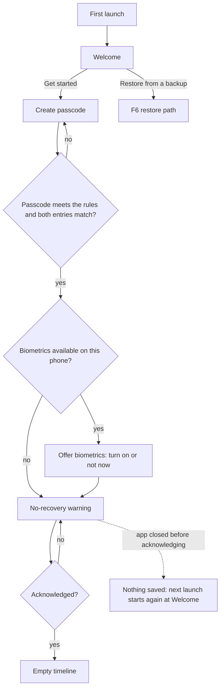
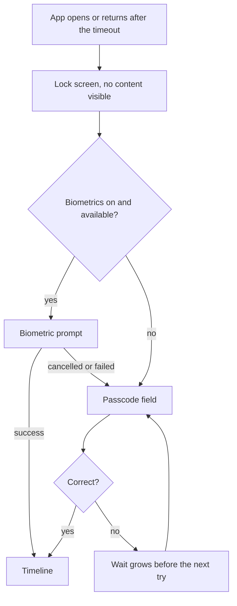
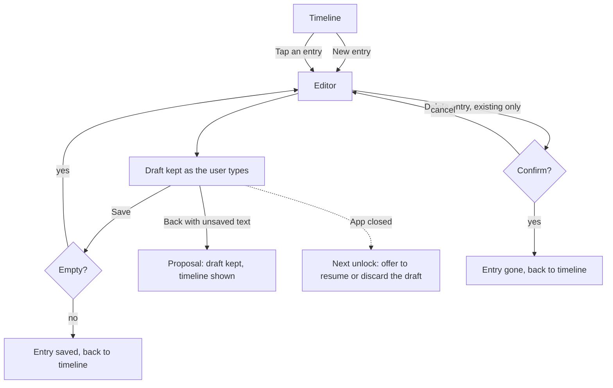
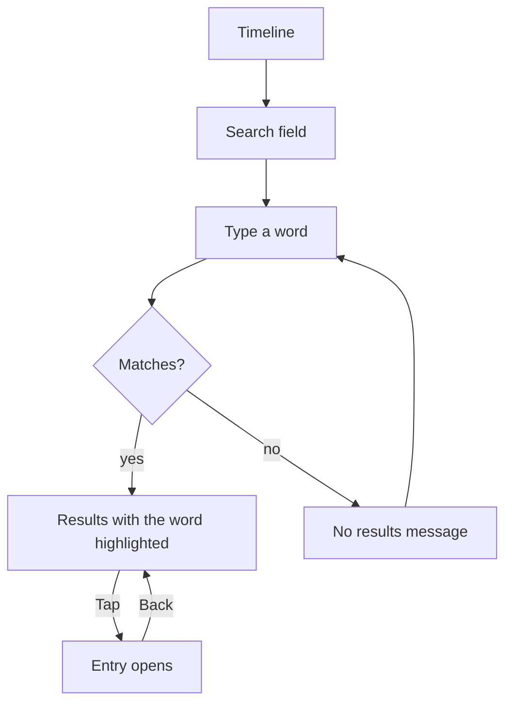
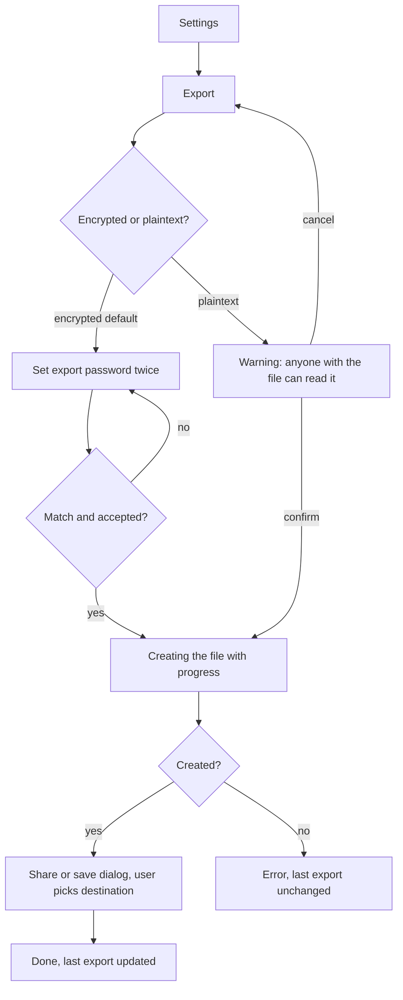
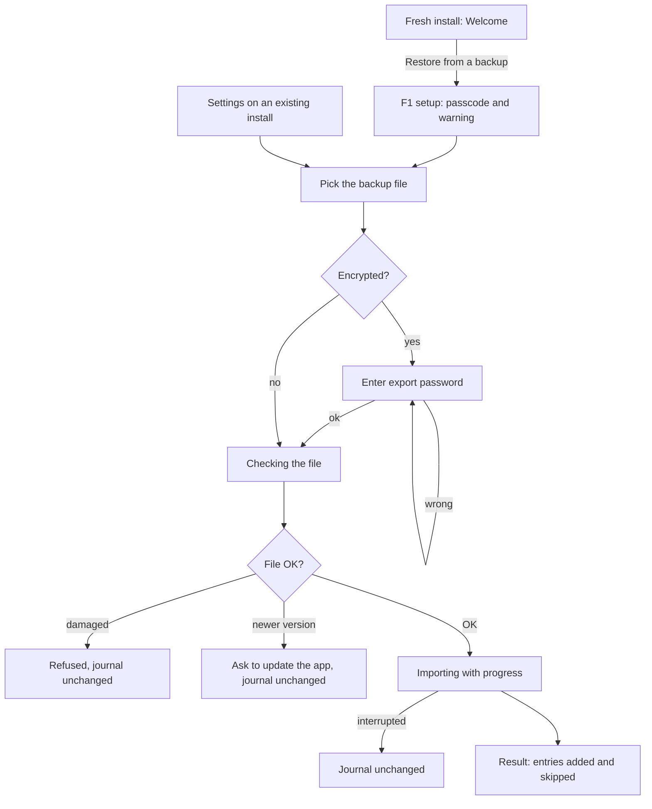
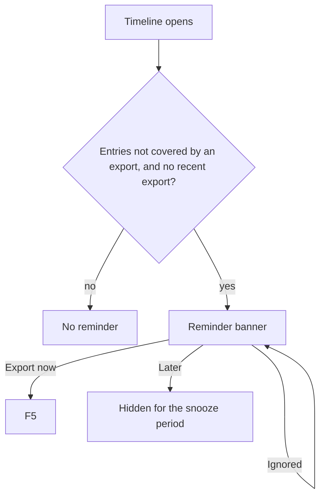
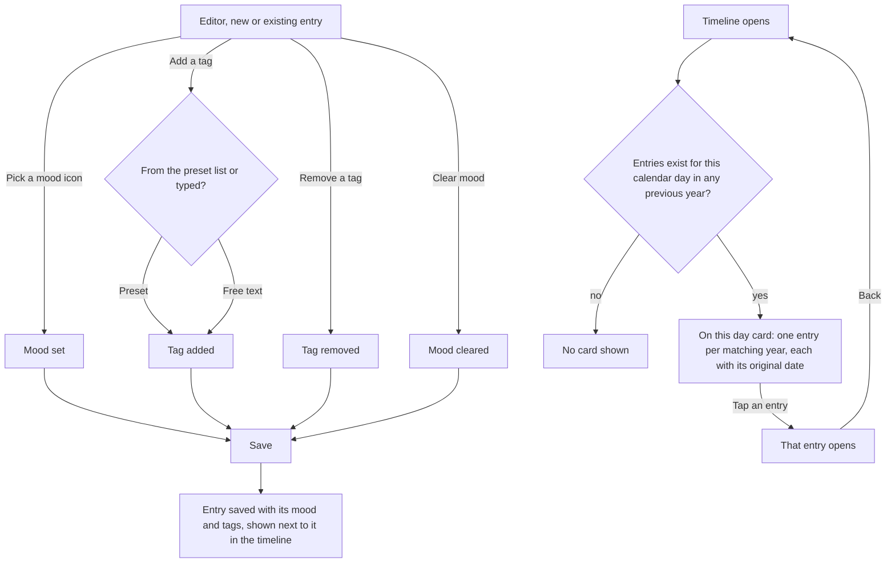
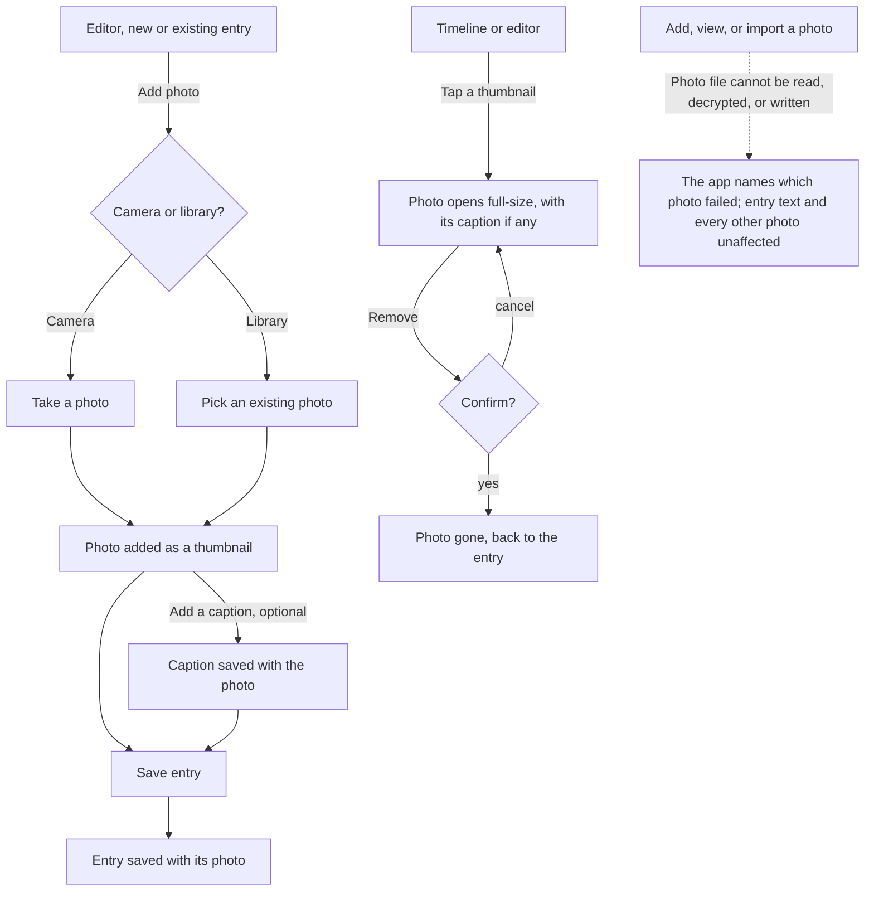

# User Flows (version 1)

Task flows for each key path, with error and recovery paths. One user, one goal per flow. Diagrams are Mermaid. Status: draft, not yet validated with users (RS-001). Where a flow needs a decision that is not yet made, it is marked **Proposal** and raised as an open question on the FEAT.

Acceptance-criteria links: the edge paths below map to criteria in the FEAT specs; tests are assigned by qa (`TC-`: QA will assign).

## F1. First run: set up and reach the empty timeline (FEAT-004)
Goal: set a passcode, understand the no-recovery rule, start writing. Entry points: first launch only. Success: the empty timeline.

| Step | Condition | System behaviour | User sees | Recovery | Linked |
|------|-----------|------------------|-----------|----------|--------|
| Passcode | Entries do not match | Does not continue | An error saying they differ | Retype | FEAT-004 |
| Passcode | Does not meet the rules | Does not continue | An error saying which rule failed | Edit | FEAT-004 |
| Biometrics | None enrolled or not supported | Skips the step | Nothing (step not shown) | Passcode still works | FEAT-004, FEAT-003 |
| Warning | Not acknowledged | Blocks the next step | The button stays unavailable, with the reason shown next to it | Tick the acknowledgment | FEAT-004 |
| Any | App closed before acknowledging | **Proposal:** nothing is stored until the warning is acknowledged | Welcome again on next launch | Start again | FEAT-004 |

## F2. Unlock (FEAT-003)
Goal: open the journal. Entry points: cold start, or return from the background after the timeout. Success: the timeline.

| Step | Condition | System behaviour | User sees | Recovery | Linked |
|------|-----------|------------------|-----------|----------|--------|
| Biometric | Face or fingerprint changed on the phone | Biometric no longer accepted | Passcode field | Enter the passcode | FEAT-003 |
| Passcode | Wrong several times | Wait before the next attempt grows | A countdown with what is happening | Wait, then retry | FEAT-003 |
| Passcode | Forgotten | Cannot be recovered | The lock screen offers no reset | Restore from a backup on a fresh install (F6) | FEAT-004, RISK-001 |
| App switcher | Preview shown | Content hidden | A blank branded screen | none needed | FEAT-003 |

## F3. Write, edit, delete an entry (FEAT-001)
Goal: capture or change an entry safely. Entry points: New entry button, tapping an entry. Success: the entry is saved and appears in the timeline.

| Step | Condition | System behaviour | User sees | Recovery | Linked |
|------|-----------|------------------|-----------|----------|--------|
| Save | Nothing typed | No entry created | Save has no effect, with a hint | Type something | FEAT-001 |
| Leaving | Unsaved text | **Proposal:** draft kept, not asked | "Draft saved" indicator | Reopen to continue | FEAT-001 |
| App closed | Unsaved text | Draft kept | A prompt to resume or discard at next unlock | Resume | FEAT-001 |
| Delete | User taps Delete | Asks to confirm; states it cannot be undone | A confirmation sheet | Cancel | FEAT-001 |
| Editor | "Draft saved" and "Save" both visible | Unclear whether Save is still needed | Possible confusion (finding in `design-review-ui-s1-s7.md`) | Test in RS-001 | FEAT-001 |

## F4. Find an entry (FEAT-005)
Goal: find an old entry by a word. Success: the entry opens.

| Step | Condition | System behaviour | User sees | Recovery | Linked |
|------|-----------|------------------|-----------|----------|--------|
| Search | No match | Nothing listed | A no-results message with a hint to try other words | Edit the query | FEAT-005 |
| Search | Entry deleted earlier | Not listed | Nothing | none needed | FEAT-005, FEAT-001 |
| Result | Back from an entry | Query and results kept | The same results | Continue | FEAT-005 |

## F5. Export (FEAT-006)
Goal: make a backup file. Entry point: Settings. Success: a file saved where the user chose, and the last export time updated.

| Step | Condition | System behaviour | User sees | Recovery | Linked |
|------|-----------|------------------|-----------|----------|--------|
| Password | Do not match | Does not continue | An error saying they differ | Retype | FEAT-006 |
| Password | Forgotten later | Backup cannot be opened | A reminder at export time to keep the password somewhere safe | Make a new export while the journal still opens | FEAT-006, RISK-001 |
| Create | Not enough storage or interrupted | No file, last export unchanged | An error saying what happened | Free space, retry | FEAT-006 |
| Save | User dismisses the dialog | Nothing saved | Back on the export screen | Try again | FEAT-006 |
| Plaintext | User confirms | File contains readable text | A visible warning before it is created | Delete the file | FEAT-006, THR-006 |

## F6. Restore on a new phone (FEAT-007, FEAT-004)
Goal: get the whole journal back. Entry points: Welcome on a fresh install, or Settings on an existing install. Success: a result screen with how many entries were added and skipped.

**Decided by the owner on 2026-09-20:** on a fresh install, passcode setup (F1 up to the warning) comes first, then the file is imported. Reason: the export password protects only the file; the journal on the phone is protected by the phone's own key created at setup (ADR-001), so a passcode must exist before data is stored.

| Step | Condition | System behaviour | User sees | Recovery | Linked |
|------|-----------|------------------|-----------|----------|--------|
| Pick file | File is in a cloud folder not yet downloaded | Cannot read it | An error saying the file could not be opened | Download it first, then retry | FEAT-007 |
| Pick file | Wrong kind of file | Refused | "This is not a backup from this app" | Pick another | FEAT-007 |
| Password | Wrong | Refused, nothing changes | An error, retry allowed | Retry, or use another backup | FEAT-007 |
| Check | Damaged or cut off | Refused, journal unchanged | An error that the file is damaged | Use another export | FEAT-007, RISK-002 |
| Check | Made by a newer app | Refused, journal unchanged | A message to update the app | Update, retry | FEAT-007, RISK-002 |
| Import | Interrupted (call, close, low battery) | All or nothing: journal unchanged | On next open, the journal as before | Retry | FEAT-007 |
| Result | Existing entries overlap | Already present entries kept | Counts of added and skipped | none needed | FEAT-007 |

## F7. Backup reminder (FEAT-008)
Goal: nudge a backup without nagging. Success: the user exports or dismisses.

| Step | Condition | System behaviour | User sees | Recovery | Linked |
|------|-----------|------------------|-----------|----------|--------|
| Banner | Shown | Never contains entry text | Plain words about backup | Dismiss | FEAT-008 |
| Banner | Dismissed | Hidden for a while, returns if still needed | Nothing, then the banner again | Export | FEAT-008 |

## F8. Mood, tags, and On this day (FEAT-010)
Goal: mark how an entry felt or what it was about, and be shown past entries from the same calendar day. Entry points: the editor (mood and tags); the timeline (the "On this day" card, when it appears). Success: the mood/tag change is saved, or a past entry from "On this day" opens.

| Step | Condition | System behaviour | User sees | Recovery | Linked |
|------|-----------|------------------|-----------|----------|--------|
| Mood | No icon picked | Entry saves without a mood | Nothing extra in the timeline | Add it later by editing | FEAT-010 |
| Mood | Icon picked | Saved with the entry | The icon, with its text label available (not colour or icon alone), next to the entry | Change or clear, same as editing text | FEAT-010 |
| Tag | Preset or free text | Either is accepted, both may be mixed on one entry | The tag next to the entry, same style regardless of origin | Remove any time | FEAT-010 |
| Tag | Removed | No longer shown | Nothing | Re-add if it was a mistake | FEAT-010 |
| On this day | No matching entry in any previous year | Card is not rendered | No empty-state card, no explanation needed | none needed | FEAT-010 |
| On this day | Matching entries in more than one previous year | All of them are shown, each dated | A short list, most recent year first (**Proposal**: order not yet confirmed by the owner) | Scroll if long | FEAT-010 |
| Locked or backgrounded | "On this day" or the timeline holds mood/tag content | Hidden by the same privacy cover as entry text (FEAT-003) | Nothing readable | Unlock | FEAT-010, FEAT-003 |

Accessibility note (`inclusive-and-accessible-design`): the mood icon's text label (already decided in FEAT-010, e.g. "Great", "Good") must be exposed to screen readers even though it is visually an icon; the icon is never the only carrier of meaning, satisfying the WCAG 2.2 AA requirement already named in FEAT-010's NFR row. No new accessibility case is needed beyond confirming this in product-design's screen spec and frontend-mobile's build.

## F9. Add, view, and remove a photo (FEAT-011)
Goal: attach a photo to an entry, look at it later, or take it off. Entry points: the editor (add), a thumbnail (view), the full-size view (remove). Success: the photo is saved with the entry, or gone if removed.

| Step | Condition | System behaviour | User sees | Recovery | Linked |
|------|-----------|------------------|-----------|----------|--------|
| Add photo | Camera or library chosen | Photo is resized/compressed on the way in (owner decision, no artificial count limit) | A new thumbnail in the editor | Remove if it was a mistake | FEAT-011 |
| Caption | Left blank | Photo still gets a generic accessible name, never blank | Nothing extra shown | Add a caption later, same as editing | FEAT-011 |
| Remove | User confirms | Photo and its file are deleted for good | Thumbnail gone | none, same as deleting an entry | FEAT-011 |
| Delete entry | Entry has photos | All its photos are deleted with it (FEAT-001 AC-6 extended) | Entry and photos gone from the timeline | none | FEAT-011, FEAT-001 |
| Locked or backgrounded | A thumbnail or full-size photo would be shown | Hidden by the same privacy cover as entry text (FEAT-003), including from a screen reader (`BlockSemantics`, fixed 2026-09-23 for FEAT-010's AC-9, applies here too since it is not content-specific) | Nothing readable or reachable | Unlock | FEAT-011, FEAT-003 |
| Photo fails | Damaged file, out of space, decrypt failure | Names which photo failed; nothing else touched | An error naming the photo | Try again; the entry's text is never at risk | FEAT-011 |

Accessibility note (`inclusive-and-accessible-design`): a photo's accessible name is its caption when it has one, otherwise a generic label (e.g. "Photo") — never blank, so a screen reader user always has something to hear, matching the mood icon's "never the icon alone" rule from F8.

## Effort per flow
| Flow | Steps to success (happy path) | Note |
|------|-------------------------------|------|
| F1 | 5 screens | Below the 7-step review line |
| F3 | 3 | Fine |
| F5 | 4 (encrypted) | Fine |
| F6 | 7 on a fresh install (setup 4, then pick, password, result) | At the review line: candidate for RS-001 |
| F8 | 1 (mood or tag change), or 1 tap (On this day) | Fine; the "On this day" ordering is a **Proposal** open question for the owner |
| F9 | 2 (pick source, then the photo itself); 3 with a caption | Fine; the camera/library choice step needs a real device to test (no camera on the emulator's virtual camera has not been verified for this app) |
